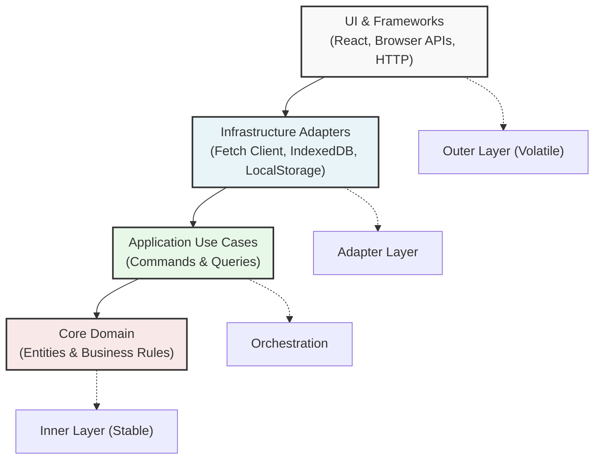

Most modern React applications start out as triumphs of developer velocity. You spin up a project with Vite, pull in a few UI libraries, throw together some `useEffect` hooks, and ship features in hours. But as team size grows and feature complexity scales, that initial speed decays into structural inertia.  

Suddenly, simple UI tweaks break unrelated business workflows, refactoring network calls requires rewriting component tests, and adding a new state variable feels like diffusing a bomb.  

This degradation isn't caused by bad developers or missing framework features—it is the direct consequence of accidental coupling. In this first installment of our series, we unpack why unmanaged dependencies destroy frontend maintainability, analyze the true cost of framework lock-in, and introduce the core rules that keep your domain logic bulletproof over time.

## 🛑 The "Fat Component" Anti-Pattern

In typical React applications, components naturally become magnets for every operational concern in the system. Consider a standard component responsible for checking out a shopping cart:

```tsx
// ❌ Accidental Coupling: Everything living inside the UI layer
export const CheckoutButton = ({ cartId }: { cartId: string }) => {
  const [loading, setLoading] = useState(false);

  const handleCheckout = async () => {
    setLoading(true);
    
    // 1. Fetching raw data directly from an API endpoint
    const res = await fetch(`/api/carts/${cartId}`);
    const cart = await res.json();

    // 2. Business Rule: Carts over $100 get free shipping, but require a minimum of 2 items
    let shippingFee = 15;

    if (cart.total > 100 && cart.items.length >= 2) {
      shippingFee = 0;
    }

    // 3. Interfacing with local storage caching directly
    localStorage.setItem('last_checkout_total', cart.total + shippingFee);

    // 4. Executing payment network mutation
    await fetch('/api/checkout', {
      method: 'POST',
      body: JSON.stringify({ cartId, amount: cart.total + shippingFee }),
    });

    setLoading(false);
  };

  return <button onClick={handleCheckout}>{loading ? 'Processing...' : 'Checkout'}</button>;
};
```

When UI components coordinate HTTP requests, evaluate domain rules, mutate local browser storage, and manage rendering logic simultaneously, you incur severe architectural liabilities:

- **Framework Lock-in:** Your core business calculations (e.g., shipping rules) are tangled directly inside React lifecycle hooks and synthetic event handlers. Switching frameworks or reusing logic outside React becomes impossible.
- **Brittle Testing:** To test whether the shipping rule works, you can't simply run a 2-millisecond unit test. You must mock `fetch`, mock `localStorage`, render a React DOM node, and simulate user clicks.
- **Data Schema Leakage:** When backend API response schemas change, your presentation code breaks instantly across dozens of UI components.

## 💸 The High Cost of UI-Centric Architecture

Why do codebases decay so rapidly when business logic lives inside presentation components? Let's break down the technical debt multiplier:

| Problem Domain             | UI-Centric Approach                                                           | Clean Architecture Approach                                                       |
|----------------------------|-------------------------------------------------------------------------------|-----------------------------------------------------------------------------------|
| **Testing Overhead**       | Heavy reliance on JSDOM, React Testing Library, and complex mock providers.   | Fast unit tests in pure TypeScript without DOM or network dependencies.           |
| **API Instability**        | Breaking API payload changes require sweeping refactors across UI components. | Mappers isolate external API contracts from internal domain entities.             |
| **State Management Drift** | Logic gets duplicated across React state, Redux, Zustand, and query caches.   | Application state logic is centralized inside explicit Use Cases.                 |
| **Framework Upgrades**     | Major React version jumps or migration to SSR risk breaking business rules.   | Core business rules have zero dependencies on React or any third-party framework. |

## 🎯 The Core Architectural Principle: The Dependency Rule

To eliminate accidental coupling, we apply the Dependency Rule, the central pillar of Clean Architecture:

> **Source code dependencies must point inward, toward high-level policies.**



### The Inviolable Rule

Nothing in an inner layer can know anything about something in an outer layer.

1. **The Domain Layer** (Entities, Value Objects) knows nothing about Use Cases, REST APIs, or React.
2. **The Application Layer** (Use Cases, Ports) knows nothing about React components or specific database drivers.
3. **The Presentation & Infrastructure Layers** (React UI, Axios, IndexedDB) depend inward on abstract interfaces defined by the application layer.

By forcing dependencies to point strictly inward, your core business rules become completely decoupled from UI frameworks, state management libraries, and external APIs.

## 🔄 Inversion of Control in Action

How does an inner layer trigger an operation (like fetching a record or storing a token) without knowing about the concrete driver executing it? Through **Inversion of Control (IoC)** via **Ports & Adapters**.  

Instead of importing an HTTP client directly inside a business rule, the Application layer defines an abstract Port (an interface):

```ts
// 1. Application Port (Owned by the core application)
export interface ICartRepository {
  getById(cartId: string): Promise<Cart>;
  save(cart: Cart): Promise<void>;
}
```

The outer Infrastructure layer implements this port via an **Adapter**:

```ts
// 2. Infrastructure Adapter (Outer layer)
export class ApiCartRepository implements ICartRepository {
  async getById(cartId: string): Promise<Cart> {
    const res = await fetch(`/api/carts/${cartId}`);
    const data = await res.json();
    return CartMapper.toDomain(data); // Maps API schema to pure Domain Entity
  }

  async save(cart: Cart): Promise<void> {
    await fetch('/api/checkout', {
      method: 'POST',
      body: JSON.stringify(CartMapper.toDTO(cart)),
    });
  }
}
```

Because the core domain relies solely on the `ICartRepository` interface, you can swap `ApiCartRepository` for an `InMemoryCartRepository` during testing or an `IndexedDBCartRepository` for offline support without modifying a single line of business logic.

## 🧪 Testing as an Architectural Indicator

One of the most immediate feedback loops of a Clean Architecture setup is test suite velocity.

When your business logic is decoupled from React and browser APIs, testing a complex domain feature doesn't require launching a headless browser or mounting virtual DOM trees.

```ts
// ✅ Pure Unit Test: Zero DOM, zero network mocks, runs in milliseconds
describe('Cart Shipping Calculation', () => {
  it('should apply free shipping for orders over $100 with at least 2 items', () => {
    const cart = Cart.create({ items: [itemA, itemB], totalAmount: 120 });
    
    expect(cart.calculateShippingFee()).toBe(0);
  });

  it('should charge shipping for orders over $100 with less than 2 items', () => {
    const cart = Cart.create({ items: [itemA], totalAmount: 150 });
    
    expect(cart.calculateShippingFee()).toBe(15);
  });
});
```

Because this test interacts purely with TypeScript domain objects, hundreds of business rule scenarios can execute in a fraction of a second in your CI/CD pipeline—giving your team instant feedback without test flakiness.

## 📢 Up Next...

Decoupling logic from the UI sounds great in theory, but how do you physically organize a codebase to enforce these boundaries without falling into folder chaos?  

**Coming up next in Part 2: The How — Architectural Layers & Domain-Driven Design**. We will examine how to structure a domain-driven codebase in strict TypeScript, build pure Domain Entities and Value Objects, and implement CQRS workflows using application-owned ports.  

Explore the reference implementation anytime on GitHub:

👉 [github.com/schorts99/React-Clean-Architecture](https://github.com/schorts99/React-Clean-Architecture)
